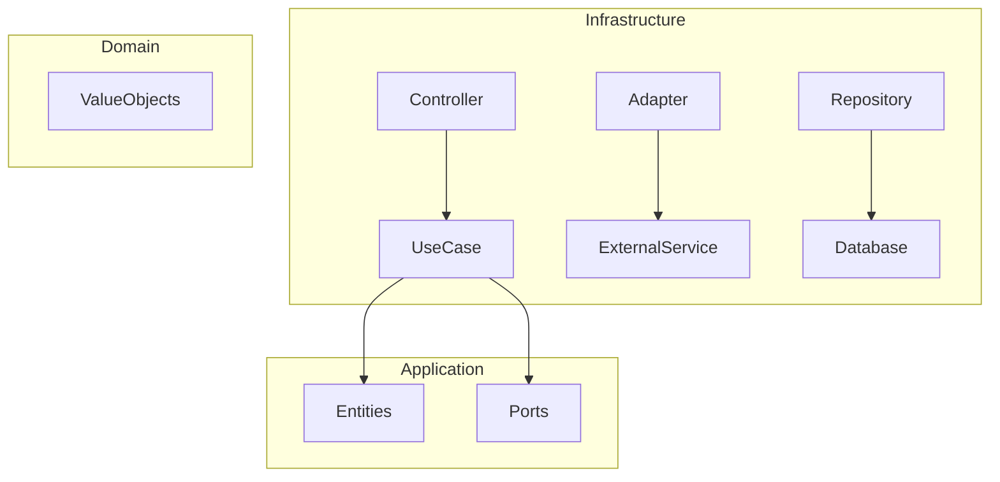
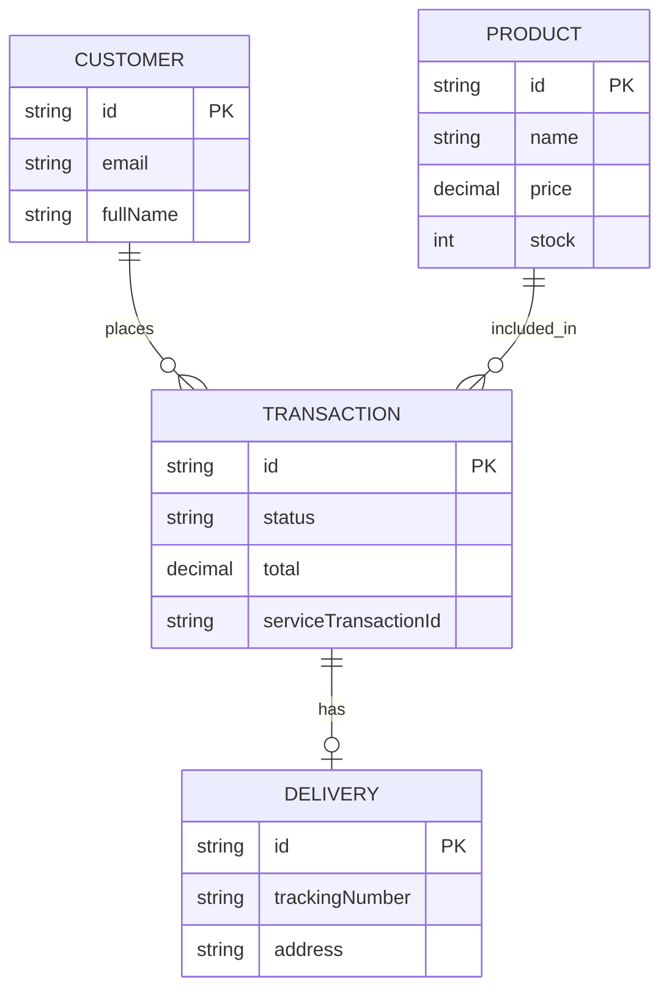

# Payment Checkout System - Backend


## 📋 Descripción
Este proyecto constituye el núcleo de procesamiento de pagos para un sistema de e-commerce moderno. Está construido siguiendo los principios de **Clean Architecture** para garantizar escalabilidad, mantenibilidad y facilidad de prueba. El backend se encarga de la gestión de productos, orquestación de transacciones con pasarelas externas (Wompi) y actualización de estados mediante Webhooks.

## ✨ Características Principales
*   **Arquitectura Limpia:** Separación estricta de responsabilidades (Domain, Application, Infrastructure).
*   **Gestión de Productos:** Catálogo de productos con control de stock en tiempo real.
*   **Procesamiento de Pagos:** Integración fluida con la pasarela de pagos Wompi.
*   **Webhooks:** Procesamiento asíncrono de notificaciones de pago para actualizar estados de transacción.
*   **Sincronización:** Tareas programadas para asegurar la consistencia del estado de las transacciones.
*   **Alta Cobertura de Pruebas:** Suite exhaustiva de pruebas unitarias cubriendo todas las capas críticas.

## 🏗️ Arquitectura
El proyecto utiliza **Clean Architecture**, dividiéndose en las siguientes capas:



*   **Domain:** Contiene las entidades de negocio y reglas fundamentales (Product, Transaction, Customer).
*   **Application:** Define los casos de uso del sistema (CreateTransaction, ProcessPayment, UpdateStock).
*   **Infrastructure:** Implementaciones técnicas como controladores REST, adaptadores de servicios externos (Wompi API) y repositorios (Prisma/Postgres).

## 📁 Estructura del Proyecto
```text
src/
├── application/         # Casos de uso, DTOs y puertos (interfaces)
├── domain/              # Entidades y objetos de valor
├── infrastructure/      # Adaptadores, controladores, bases de datos y jobs
│   ├── adapters/        # Integraciones con servicios externos (Wompi)
│   ├── controllers/     # Endpoints de la API REST
│   └── database/        # Repositorios Prisma
├── shared/              # Utilidades compartidas y manejo de errores
└── main.ts              # Punto de entrada de la aplicación
```

## 🛠️ Tecnologías
*   **Backend Framework:** [NestJS](https://nestjs.com/) (Node.js)
*   **Lenguaje:** [TypeScript](https://www.typescriptlang.org/)
*   **Base de Datos:** [PostgreSQL](https://www.postgresql.org/)
*   **ORM:** [Prisma](https://www.prisma.io/)
*   **Pasarela de Pagos:** [Wompi API](https://docs.wompi.co/)
*   **Contenerización:** [Docker](https://www.docker.com/) / Docker Compose
*   **Testing:** [Jest](https://jestjs.io/)

## 💾 Modelo de Datos
El esquema está diseñado para rastrear el ciclo de vida completo de una compra y su entrega.



## 🚀 Instalación y Configuración

1.  **Clonar el repositorio:**
    ```bash
    git clone [url-del-repo]
    cd payment-checkout-system-back
    ```

2.  **Configurar variables de entorno:**
    Copia el archivo `.env.example` a `.env` y completa las credenciales necesarias (DB, Wompi Keys).
    ```bash
    cp .env.example .env
    ```

3.  **Levantar servicios con Docker:**
    ```bash
    docker-compose up -d
    ```

4.  **Ejecutar migraciones y seeds:**
    ```bash
    npm run prisma:migrate
    npm run prisma:seed
    ```

## 🔌 API Endpoints
| Método | Endpoint | Descripción |
| :--- | :--- | :--- |
| `GET` | `/products` | Obtiene la lista de productos disponibles. |
| `POST` | `/payments/transaction` | Inicia una nueva transacción de pago. |
| `GET` | `/payments/transaction/:id` | Consulta el estado de una transacción. |
| `POST` | `/webhooks/wompi` | Punto de recepción para notificaciones de Wompi. |

## 🧪 Testing
El proyecto mantiene un alto estándar de calidad con pruebas automatizadas.

```bash
# Ejecutar pruebas unitarias
npm run test

# Generar reporte de cobertura
npm run test:cov
```
> **Cobertura actual:** 100% en Domain, 98% en Application, e Infrastructure.

## 📦 Deployment
El backend está listo para ser desplegado en servicios de AWS utilizando contenedores Docker. Se recomienda el uso de **NestJS Mau** para despliegues rápidos en AWS o procesos de CI/CD con GitHub Actions.

## 🔒 Seguridad
*   **Validación de Datos:** Uso de `class-validator` y `class-transformer` en todos los DTOs.
*   **Firma de Integridad:** Implementación de firmas SHA-256 para asegurar la integridad de las transacciones con Wompi.
*   **CORS:** Configurado para permitir accesos controlados desde el frontend.

## 🎯 Flujo de Usuario
1.  **Selección:** El usuario selecciona un producto y proporciona sus datos de contacto y entrega.
2.  **Iniciación:** El sistema crea una transacción en estado `PENDING` y reserva el stock.
3.  **Procesamiento:** Se envía la solicitud de pago a la pasarela (Wompi) con el token de tarjeta.
4.  **Confirmación:** La pasarela notifica el resultado mediante un Webhook asíncrono.
5.  **Finalización:** El sistema actualiza el estado (APPROVED/DECLINED), ajustando definitivamente el stock y generando información de entrega si el pago fue exitoso.

## 🤝 Contribución
Si deseas contribuir, por favor abre un Pull Request detallando los cambios o reporta un Issue para discusión previa.

## 📄 Licencia
Este proyecto está bajo la licencia [UNLICENSED].
